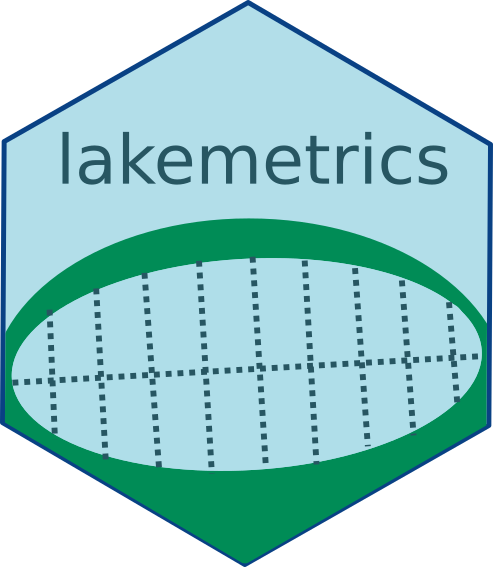

<!-- README.md is generated from README.Rmd. Please edit that file -->

# lakemetrics 

<!-- badges: start -->

[](https://www.tidyverse.org/lifecycle/#maturing)
[](commits/master)
[](https://www.gnu.org/licenses/gpl-3.0.en.html)
<!-- [](https://github.com/SebastienBoutry/IBDL/actions) -->
<!-- badges: end -->

## Préambule

### Installation de `{lakemetrics}`

Le paquet `{lakemetrics}` peut se télécharger via le site Github pour
cela on aura besoin du paquet `{remotes}`:

``` r
remotes::install_github("SebastienBoutry/lakemetrics")
```
